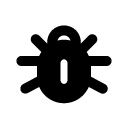

# STIX Icons

## Overview

stix-icons is a collection of colourful and clean icons for use in software, training and marketing material to visualize cyber threats according to the [STIX](https://oasis-open.github.io/cti-documentation/stix/intro) language for intelligence exchange, defined by [OASIS Cyber Threat Intelligence (CTI) TC](https://www.oasis-open.org/committees/tc_home.php?wg_abbrev=cti)

## Content


### STIX Icons Available

The following tables show all variations of the supported icons;

#### SDOs

  Object         |     RGB   | RGB, circle | Black | Black, circle | White | White, circle
  :------------- | :--------------: | :-----------: | :--------------: | :-----------: | :--------------: | :-----------: 
Attack Pattern |  |  |  |  |  | 
Campaign |  |  |  |  |  | 
Course of Action |  |  |  |  |  | 
Grouping |  |  |  |  |  | 
Identity Class |  |  |  |  |  | 
Identity Generic |  |  |  |  |  | 
Identity Group |  |  |  |  |  | 
Identity Individual |  |  |  |  |  | 
Identity Organization |  |  |  |  |  | 
Identity System |  |  |  |  |  | 
Incident |  |  |  |  |  | 
Indicator |  |  |  |  |  | 
Infrastructure |  |  |  |  |  | 
Intrusion Set |  |  |  |  |  | 
Location |  |  |  |  |  | 
Malware |  |  |  |  |  | 
Malware Analysis |  |  |  |  |  | 
Malware Family |  |  |  |  |  | 
Note |  |  |  |  |  | 
Observed Data |  |  |  |  |  | 
Opinion |  |  |  |  |  | 
Report |  |  |  |  |  | 
Threat Actor |  |  |  |  |  | 
Tool |  |  |  |  |  | 
Vulnerability |  |  |  |  |  | 

WIP 

1. Weakness
  * https://www.flaticon.com/free-icon/link-break_58899?term=break&page=1&position=29&origin=search&related_id=58899

#### SCOs

WIP

1. [Artifact Object](https://docs.oasis-open.org/cti/stix/v2.1/os/stix-v2.1-os.html#_4jegwl6ojbes)
  * https://www.flaticon.com/free-icon/code_984196?term=code&page=1&position=29&origin=search&related_id=984196
2. [AS Object](https://docs.oasis-open.org/cti/stix/v2.1/os/stix-v2.1-os.html#_27gux0aol9e3)
  * https://www.flaticon.com/free-icon/tag_7991247?term=tag&page=1&position=55&origin=search&related_id=7991247
3. [Directory Object](https://docs.oasis-open.org/cti/stix/v2.1/os/stix-v2.1-os.html#_lyvpga5hlw52)
  * https://www.flaticon.com/free-icon/open-folder_10303584?term=directory&page=1&position=3&origin=search&related_id=10303584
4. [Domain Name Object](https://docs.oasis-open.org/cti/stix/v2.1/os/stix-v2.1-os.html#_prhhksbxbg87)
  * https://www.flaticon.com/free-icon/domains_564917?term=domain&page=1&position=11&origin=search&related_id=564917
5. [Email Address Object](https://docs.oasis-open.org/cti/stix/v2.1/os/stix-v2.1-os.html#_wmenahkvqmgj)
  * https://fontawesome.com/icons/at?f=classic&s=solid
6. [Email Message Object](https://docs.oasis-open.org/cti/stix/v2.1/os/stix-v2.1-os.html#_grboc7sq5514)
  * https://fontawesome.com/icons/envelope?f=classic&s=solid
7. [File Object](https://docs.oasis-open.org/cti/stix/v2.1/os/stix-v2.1-os.html#_99bl2dibcztv)
  * https://fontawesome.com/icons/file?f=classic&s=solid
8. [IPv4 Address Object](https://docs.oasis-open.org/cti/stix/v2.1/os/stix-v2.1-os.html#_ki1ufj1ku8s0)
  * https://www.flaticon.com/free-icon/placeholder_1451757?term=ip&page=1&position=21&origin=search&related_id=1451757
9. [IPv6 Address Object](https://docs.oasis-open.org/cti/stix/v2.1/os/stix-v2.1-os.html#_oeggeryskriq)
  * https://www.flaticon.com/free-icon/placeholder_1451757?term=ip&page=1&position=21&origin=search&related_id=1451757
10. [MAC Address Object](https://docs.oasis-open.org/cti/stix/v2.1/os/stix-v2.1-os.html#_f92nr9plf58y)
  * https://www.flaticon.com/free-icon/barcode_1550324?term=barcode&page=1&position=4&origin=search&related_id=1550324
11. [Mutex Object](https://docs.oasis-open.org/cti/stix/v2.1/os/stix-v2.1-os.html#_84hwlkdmev1w)
  * https://www.flaticon.com/free-icon/padlock_25239?term=lock&page=1&position=7&origin=search&related_id=25239
12. [Network Traffic Object](https://docs.oasis-open.org/cti/stix/v2.1/os/stix-v2.1-os.html#_rgnc3w40xy)
  * https://fontawesome.com/icons/network-wired?f=classic&s=solid
13. [Process Object](https://docs.oasis-open.org/cti/stix/v2.1/os/stix-v2.1-os.html#_hpppnm86a1jm)
  * https://www.flaticon.com/free-icon/flow-chart_16818023?term=process&page=1&position=77&origin=search&related_id=16818023
14. [Software Object](https://docs.oasis-open.org/cti/stix/v2.1/os/stix-v2.1-os.html#_7rkyhtkdthok)
  * https://www.flaticon.com/free-icon/option_3018978?term=app&page=1&position=19&origin=search&related_id=3018978
15. [URL Object](https://docs.oasis-open.org/cti/stix/v2.1/os/stix-v2.1-os.html#_ah3hict2dez0)
  * https://www.flaticon.com/free-icon/link_15400353?term=url&page=1&position=30&origin=search&related_id=15400353
16. [User Account Object](https://docs.oasis-open.org/cti/stix/v2.1/os/stix-v2.1-os.html#_azo70vgj1vm2)
  * https://fontawesome.com/icons/user?f=classic&s=solid
17. [Windows Registry Key Object](https://docs.oasis-open.org/cti/stix/v2.1/os/stix-v2.1-os.html#_luvw8wjlfo3y)
  * https://www.flaticon.com/free-icon/cubes_4352471?term=blocks&page=1&position=12&origin=search&related_id=4352471
18. [X.509 Certificate Object](https://docs.oasis-open.org/cti/stix/v2.1/os/stix-v2.1-os.html#_8abcy1o5x9w1)
  * https://www.flaticon.com/free-icon/document_73524?term=certificate&page=1&position=31&origin=search&related_id=73524
19. Bank Card
  * https://fontawesome.com/icons/credit-card-front?f=classic&s=solid
20. Bank Account
  * https://www.flaticon.com/free-icon/bank_7710772?term=bank+account&page=1&position=31&origin=search&related_id=7710772
21. Cryptocurrency Wallet
  * https://www.flaticon.com/free-icon/wallet_6826311?term=wallet+digital&page=1&position=6&origin=search&related_id=6826311
22. Cryptocurrency Transaction 
  * https://www.flaticon.com/free-icon/transaction_4166062?term=digital+transaction&page=1&position=23&origin=search&related_id=4166062
23. Phone Number
  * https://fontawesome.com/icons/phone?f=classic&s=solid
24. User Agent
  * https://fontawesome.com/icons/browser?f=classic&s=solid

#### SMOs

WIP

1. Language Content: https://www.flaticon.com/free-icon/language_484582?term=language&page=1&position=3&origin=search&related_id=484582
2. Marking Definition: https://www.flaticon.com/free-icon/quotation-mark_32371?term=marking&page=1&position=26&origin=search&related_id=32371
  * TLP: https://fontawesome.com/icons/traffic-light?f=classic&s=solid
3. Extension Definition: https://www.flaticon.com/free-icon/full-screen_159121?term=extend&page=1&position=29&origin=search&related_id=159121

#### SROs

  Object         |     RGB   | RGB, circle | Black | Black, circle | White | White, circle
  :------------- | :--------------: | :-----------: | :--------------: | :-----------: | :--------------: | :-----------: 
Relationship |  |  |  |  |  | 
Sighting |  |  |  |  |  | 

## Generating the objects

This 

```shell
# clone the latest code
git clone https://github.com/muchdogesec/stix_icons
# create a venv
cd stix_icons
python3 -m venv stix_icons-venv
source stix_icons-venv/bin/activate
# install requirements
pip3 install -r requirements.txt
```

Now modify your icons

## Credits

[This work is an expansion of the STIX objects created by EclecticIQ](https://github.com/eclecticiq/stix-icons/).

## Licenses

* Code: [Apache 2.0](/LICENSE).
* Content: [Creative Commons Attribution 4.0 International Public License](/LICENSE-CONTENT)