# stix2icons

## Overview

stix2icons is a collection of icons that represent all the of core STIX objects. The aim is to provide a central source of icons that can be used to represent STIX objects by software tools (or anything else).

This repo is designed so that new icons can be added for custom STIX objects you're developing. See: "Adding your own objects".

## tl;dr

[](https://www.youtube.com/watch?v=U5KIsulBN9E)

## Where to find icons in this repository

The icons are provided in three colour versions: color, black, and white.

There are two variations of each colour provided; 1) with (normal) and 2) without a 'circle' (round) behind the icons.

Each icon has an `.svg` version and a `.png` (256x256) version. Generally you should use the `.svg` version and scale as required.

```txt
output/
├── black/
│   ├── normal/
│   │   ├── png
│   │   └── svg
│   ├── round/
│   │   ├── png
│   │   └── svg
├── rgb/
│   ├── normal/
│   │   ├── png
│   │   └── svg
│   ├── round/
│   │   ├── png
│   │   └── svg
└── white/
    ├── normal/
    │   ├── png
    │   └── svg
    └── round/
        ├── png
        └── svg
```

## Currently supported objects

| Object | Type | RGB | HEX | RGB Icon | RGB Circle Icon | Black Icon | Black Circle Icon | White Icon | White Circle Icon |
|--------|------|-----|-----|----------|-----------------|------------|------------------|------------|------------------|
| attack-pattern | sdo | 34,119,181 | #2277b5 |  |  |  |  |  |  |
| campaign | sdo | 80,182,30 | #50b61e |  |  |  |  |  |  |
| course-of-action | sdo | 161,198,40 | #a1c628 |  |  |  |  |  |  |
| grouping | sdo | 163,53,139 | #a3358b |  |  |  |  |  |  |
| identity | sdo | 156,154,254 | #9c9afe |  |  |  |  |  |  |
| incident | sdo | 251,182,22 | #fbb616 |  |  |  |  |  |  |
| indicator | sdo | 220,149,71 | #dc9547 |  |  |  |  |  |  |
| infrastructure | sdo | 174,215,191 | #aed7bf |  | 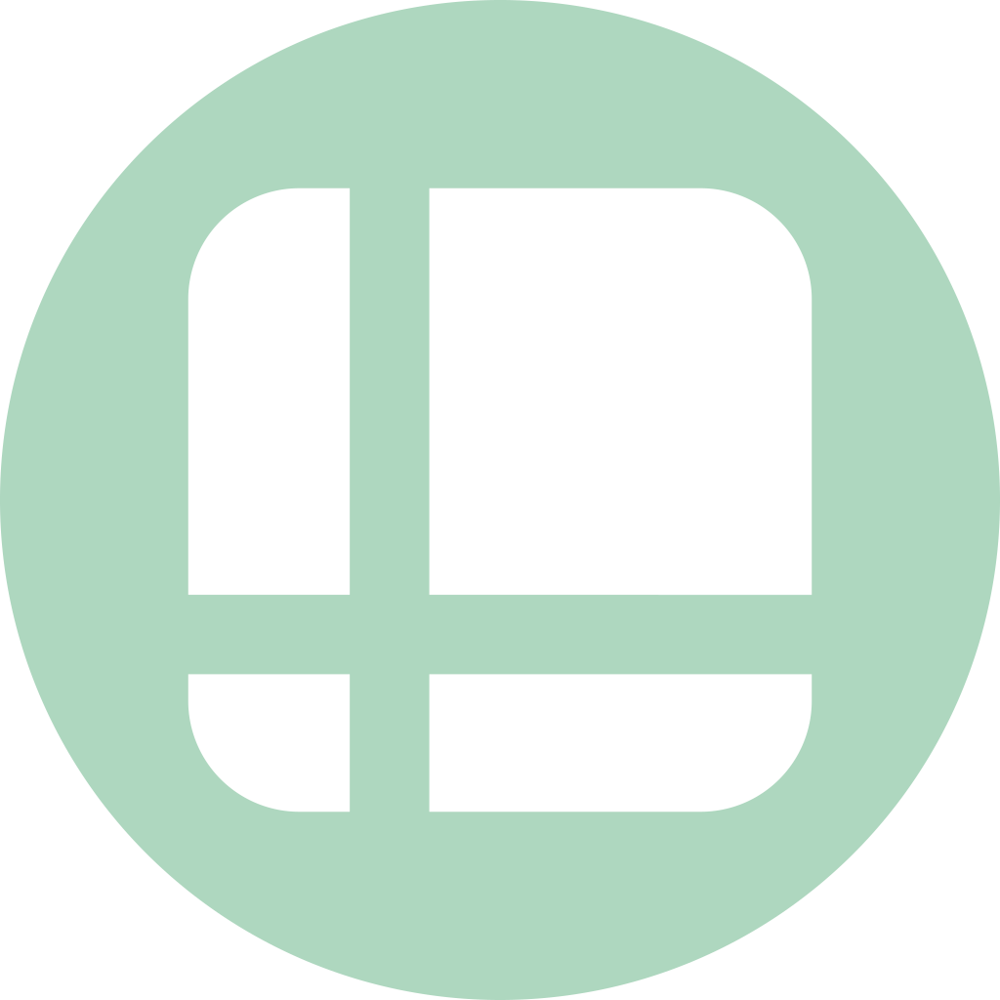 |  |  |  |  |
| intrusion-set | sdo | 56,178,193 | #38b2c1 |  |  |  |  |  |  |
| location | sdo | 252,159,157 | #fc9f9d |  |  |  |  |  |  |
| malware | sdo | 212,163,203 | #d4a3cb | 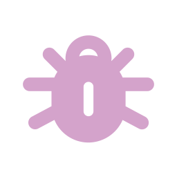 |  |  |  |  |  |
| malware-analysis | sdo | 231,118,172 | #e776ac | 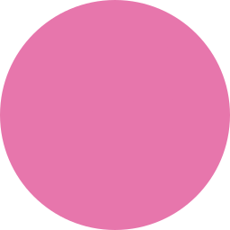 |  |  |  |  |  |
| note | sdo | 136,200,129 | #88c881 |  |  |  |  |  |  |
| observed-data | sdo | 252,204,184 | #fcccb8 |  | 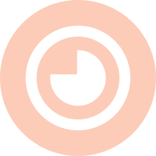 |  |  |  |  |
| opinion | sdo | 144,157,199 | #909dc7 |  |  |  |  |  |  |
| report | sdo | 119,146,121 | #779279 |  |  |  |  |  |  |
| threat-actor | sdo | 230,27,92 | #e61b5c |  | 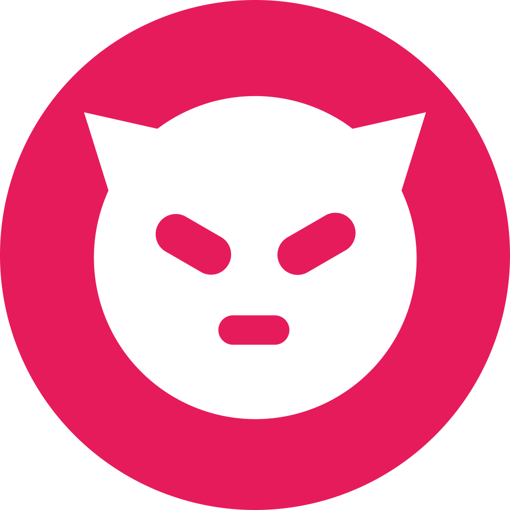 |  |  |  |  |
| tool | sdo | 87,80,157 | #57509d |  |  |  |  |  |  |
| vulnerability | sdo | 255,209,0 | #ffd100 |  | 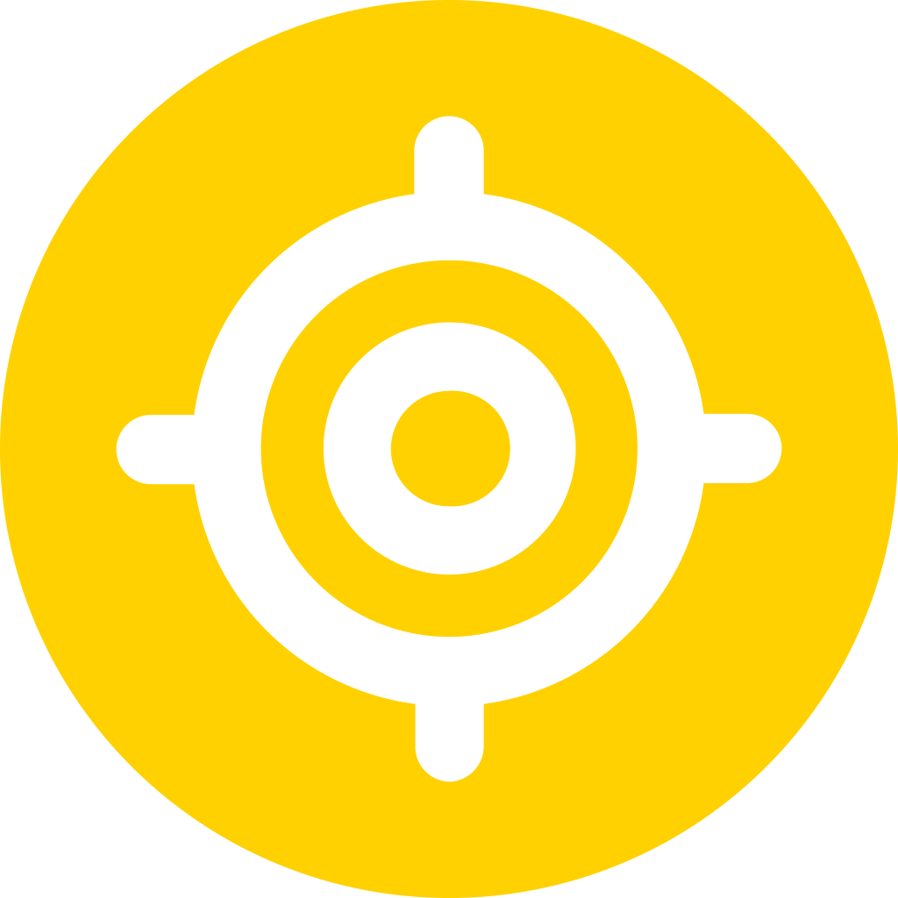 |  |  |  | 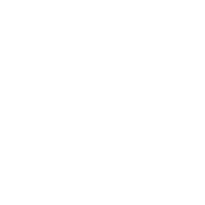 |
| weakness | sdo | 94,49,128 | #5e3180 |  |  |  |  |  |  |
| artifact | sco | 149,229,250 | #95e5fa |  |  |  |  |  |  |
| autonomous-system | sco | 161,248,128 | #a1f880 |  |  |  |  | 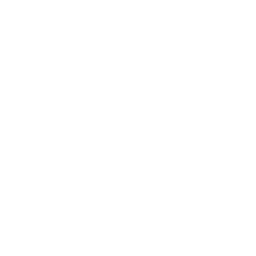 |  |
| directory | sco | 183,245,206 | #b7f5ce |  |  |  |  |  |  |
| domain-name | sco | 255,185,167 | #ffb9a7 |  |  |  |  |  |  |
| email-addr | sco | 145,128,242 | #9180f2 |  |  |  |  |  |  |
| email-message | sco | 249,129,229 | #f981e5 |  |  |  |  |  |  |
| file | sco | 199,148,187 | #c794bb |  |  |  |  |  |  |
| ipv4-addr | sco | 222,130,171 | #de82ab |  | 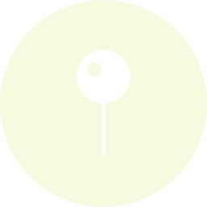 |  |  |  |  |
| ipv6-addr | sco | 222,130,171 | #de82ab |  | 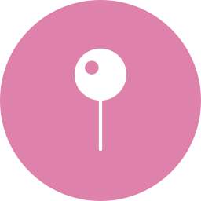 |  |  |  |  |
| mac-addr | sco | 247,184,203 | #f7b8cb | 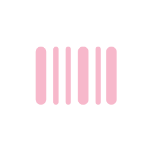 |  |  |  |  |  |
| mutex | sco | 240,228,153 | #f0e499 |  |  |  |  |  |  |
| network-traffic | sco | 132,207,240 | #84cff0 |  |  |  |  |  |  |
| process | sco | 187,199,153 | #bbc799 |  | 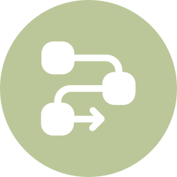 |  |  |  |  |
| software | sco | 233,145,202 | #e991ca |  |  |  |  |  |  |
| url | sco | 206,207,241 | #cecff1 |  |  |  |  |  |  |
| user-account | sco | 213,191,132 | #d5bf84 |  |  |  |  |  |  |
| windows-registry-key | sco | 132,196,170 | #84c4aa |  | 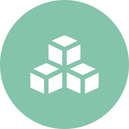 |  |  |  |  |
| x509-certificate | sco | 246,160,242 | #f6a0f2 |  |  |  |  |  |  |
| bank-account | sco | 232,228,170 | #e8e4aa |  | 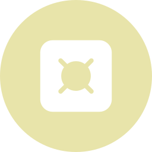 |  |  |  |  |
| bank-card | sco | 145,178,181 | #91b2b5 |  |  |  |  |  |  |
| cryptocurrency-transaction | sco | 222,233,167 | #dee9a7 |  |  |  |  |  |  |
| cryptocurrency-wallet | sco | 156,218,184 | #9cdab8 |  |  |  |  |  |  |
| cryptocurrency-exchange.svg | sco | 0,0,255 | #0000ff |  |  |  |  |  |  |
| phone-number | sco | 226,189,239 | #e2bdef |  |  |  |  |  |  |
| user-agent | sco | 152,199,239 | #98c7ef |  |  |  |  |  |  |
| relationship | sro | 148,243,139 | #94f38b |  | 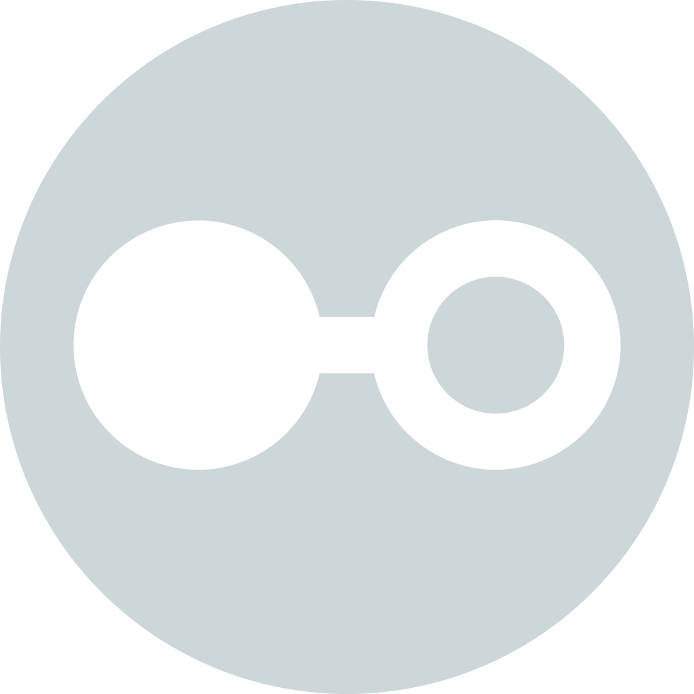 |  |  |  |  |
| sighting | sro | 235,94,42 | #eb5e2a |  |  |  |  |  |  |

## Adding your own objects

To start with, clone this repository.

```shell
# clone the latest code
git clone https://github.com/muchdogesec/stix2icons
# create a venv
cd stix2icons
python3 -m venv stix2icons-venv
source stix2icons-venv/bin/activate
# install requirements
pip3 install -r requirements.txt
```

The `input_vectors` contains vector files (`.svg`s) used to automatically generate types/colours/sizrs in `output_files`. The `input_vectors` directory is structured as follows;

```txt
input_vectors/
├── normal/
│   ├── sco/
│   ├── sdo/
│   └── sro/
└── round/
    ├── sco/
    ├── sdo/
    └── sro/
```

Where `sco`, `sdo`, or `sro` is the type of STIX object.

When adding objects you should:

* place it in the the correct type directory (e.g. `sdo`)
* supply both a `normal` and `round` variation.
* keep your `svg` files as simple as possible, using only `paths`, `rect`, `circle`, and `ellipse` tags. This is because the `output_files` are generated automatically and the script that performs the generation is only smart enough to handle these types.

Once you have added a `normal` and `round` variation of your object you need to add an entry for it in `generate_icons.py` under `objects` in the format;

```json
{"object": "<STIX OBJECT>", "type": "<TYPE>", "colour_rgb": "<COLOUR IN R,G,B>"}
```

e.g.

```json
{"object": "attack-pattern", "type": "sdo", "colour_rgb": "34,119,181"},
```

Once done, you can then run the script;

```shell
python3 generate_icons.py
```

This will generate a black, white and colour version of your object as an `svg` and `png` (256x256).

If you want us to publish your icon in this repository for everyone to use, make a pull request after following all the steps above.

## Credits

* [This work is an expansion of the STIX objects created by EclecticIQ](https://github.com/eclecticiq/stix-icons/)
* [It is also heavily inspired by this work from Bret Jordan](https://github.com/freetaxii/stix2-graphics)

## Support

[Minimal support provided via the DOGESEC community](https://community.dogesec.com/).

## Licenses

* Code: [Apache 2.0](/LICENSE)
* Content: [Creative Commons Attribution 4.0 International Public License](/LICENSE-CONTENT)