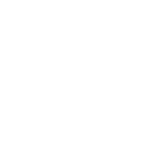
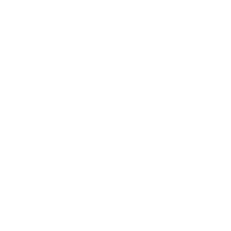

# stix2icons

## Overview

stix2icons is a collection of icons that represent all the of core STIX objects. The aim is to provide a central source of icons that can be used to represent STIX objects by software tools (or anything else).

This repo is designed so that new icons can be added for custom STIX objects you're developing. See: "Adding your own objects"

## Where to find icons in this repository

The icons are provided in three colour versions: color, black, and white.

There are two variations of each colour provided: with (normal) and without a 'circle' (round) behind the icons.

Each icon has an `.svg` version and a `.png` (256x256) version. Generally you should use the `.svg` version and scale as required.

```txt
output/
├── black/
│   ├── normal/
│   │   ├── png
│   │   └── svg
│   ├── round/
│   │   ├── png
│   │   └── svg
├── rgb/
│   ├── normal/
│   │   ├── png
│   │   └── svg
│   ├── round/
│   │   ├── png
│   │   └── svg
└── white/
    ├── normal/
    │   ├── png
    │   └── svg
    └── round/
        ├── png
        └── svg
```

## Currently supported objects

| Object | Type | RGB | RGBCircle | Black | BlackCircle | White | WhiteCircle |
|--------|------|-----|-----------|-------|-------------|-------|-------------|
| attack-pattern | sdo |  |  |  |  |  |  |
| campaign | sdo |  |  |  |  |  |  |
| course-of-action | sdo |  |  |  |  |  |  |
| grouping | sdo |  |  |  |  |  |  |
| identity | sdo |  |  |  |  |  |  |
| identity_group | sdo |  |  |  |  |  |  |
| identity_system | sdo |  |  |  |  |  |  |
| identity_organization | sdo |  |  |  |  |  |  |
| identity_individual | sdo |  |  |  |  |  |  |
| identity_class | sdo |  |  |  |  |  |  |
| incident | sdo |  |  |  |  |  |  |
| indicator | sdo |  |  |  |  |  |  |
| infrastructure | sdo |  |  |  |  |  |  |
| intrusion-set | sdo |  |  |  |  |  |  |
| location | sdo |  |  |  |  |  |  |
| malware | sdo |  |  |  |  |  |  |
| malware_family | sdo |  |  |  |  |  |  |
| malware-analysis | sdo |  |  |  |  |  |  |
| note | sdo |  |  |  |  |  |  |
| observed-data | sdo |  |  |  |  |  |  |
| opinion | sdo |  |  |  |  |  |  |
| report | sdo |  |  |  |  |  |  |
| threat-actor | sdo |  |  |  |  |  |  |
| tool | sdo |  |  |  |  |  |  |
| vulnerability | sdo |  |  |  |  |  |  |

## WIP

### SDOs

1. Weakness
  * https://www.flaticon.com/free-icon/link-break_58899?term=break&page=1&position=29&origin=search&related_id=58899

### SCOs

1. [Artifact Object](https://docs.oasis-open.org/cti/stix/v2.1/os/stix-v2.1-os.html#_4jegwl6ojbes)
  * https://www.flaticon.com/free-icon/code_984196?term=code&page=1&position=29&origin=search&related_id=984196
2. [AS Object](https://docs.oasis-open.org/cti/stix/v2.1/os/stix-v2.1-os.html#_27gux0aol9e3)
  * https://www.flaticon.com/free-icon/tag_7991247?term=tag&page=1&position=55&origin=search&related_id=7991247
3. [Directory Object](https://docs.oasis-open.org/cti/stix/v2.1/os/stix-v2.1-os.html#_lyvpga5hlw52)
  * https://www.flaticon.com/free-icon/open-folder_10303584?term=directory&page=1&position=3&origin=search&related_id=10303584
4. [Domain Name Object](https://docs.oasis-open.org/cti/stix/v2.1/os/stix-v2.1-os.html#_prhhksbxbg87)
  * https://www.flaticon.com/free-icon/domains_564917?term=domain&page=1&position=11&origin=search&related_id=564917
5. [Email Address Object](https://docs.oasis-open.org/cti/stix/v2.1/os/stix-v2.1-os.html#_wmenahkvqmgj)
  * https://fontawesome.com/icons/at?f=classic&s=solid
6. [Email Message Object](https://docs.oasis-open.org/cti/stix/v2.1/os/stix-v2.1-os.html#_grboc7sq5514)
  * https://fontawesome.com/icons/envelope?f=classic&s=solid
7. [File Object](https://docs.oasis-open.org/cti/stix/v2.1/os/stix-v2.1-os.html#_99bl2dibcztv)
  * https://fontawesome.com/icons/file?f=classic&s=solid
8. [IPv4 Address Object](https://docs.oasis-open.org/cti/stix/v2.1/os/stix-v2.1-os.html#_ki1ufj1ku8s0)
  * https://www.flaticon.com/free-icon/placeholder_1451757?term=ip&page=1&position=21&origin=search&related_id=1451757
9. [IPv6 Address Object](https://docs.oasis-open.org/cti/stix/v2.1/os/stix-v2.1-os.html#_oeggeryskriq)
  * https://www.flaticon.com/free-icon/placeholder_1451757?term=ip&page=1&position=21&origin=search&related_id=1451757
10. [MAC Address Object](https://docs.oasis-open.org/cti/stix/v2.1/os/stix-v2.1-os.html#_f92nr9plf58y)
  * https://www.flaticon.com/free-icon/barcode_1550324?term=barcode&page=1&position=4&origin=search&related_id=1550324
11. [Mutex Object](https://docs.oasis-open.org/cti/stix/v2.1/os/stix-v2.1-os.html#_84hwlkdmev1w)
  * https://www.flaticon.com/free-icon/padlock_25239?term=lock&page=1&position=7&origin=search&related_id=25239
12. [Network Traffic Object](https://docs.oasis-open.org/cti/stix/v2.1/os/stix-v2.1-os.html#_rgnc3w40xy)
  * https://fontawesome.com/icons/network-wired?f=classic&s=solid
13. [Process Object](https://docs.oasis-open.org/cti/stix/v2.1/os/stix-v2.1-os.html#_hpppnm86a1jm)
  * https://www.flaticon.com/free-icon/flow-chart_16818023?term=process&page=1&position=77&origin=search&related_id=16818023
14. [Software Object](https://docs.oasis-open.org/cti/stix/v2.1/os/stix-v2.1-os.html#_7rkyhtkdthok)
  * https://www.flaticon.com/free-icon/option_3018978?term=app&page=1&position=19&origin=search&related_id=3018978
15. [URL Object](https://docs.oasis-open.org/cti/stix/v2.1/os/stix-v2.1-os.html#_ah3hict2dez0)
  * https://www.flaticon.com/free-icon/link_15400353?term=url&page=1&position=30&origin=search&related_id=15400353
16. [User Account Object](https://docs.oasis-open.org/cti/stix/v2.1/os/stix-v2.1-os.html#_azo70vgj1vm2)
  * https://fontawesome.com/icons/user?f=classic&s=solid
17. [Windows Registry Key Object](https://docs.oasis-open.org/cti/stix/v2.1/os/stix-v2.1-os.html#_luvw8wjlfo3y)
  * https://www.flaticon.com/free-icon/cubes_4352471?term=blocks&page=1&position=12&origin=search&related_id=4352471
18. [X.509 Certificate Object](https://docs.oasis-open.org/cti/stix/v2.1/os/stix-v2.1-os.html#_8abcy1o5x9w1)
  * https://www.flaticon.com/free-icon/document_73524?term=certificate&page=1&position=31&origin=search&related_id=73524
19. Bank Card
  * https://fontawesome.com/icons/credit-card-front?f=classic&s=solid
20. Bank Account
  * https://www.flaticon.com/free-icon/bank_7710772?term=bank+account&page=1&position=31&origin=search&related_id=7710772
21. Cryptocurrency Wallet
  * https://www.flaticon.com/free-icon/wallet_6826311?term=wallet+digital&page=1&position=6&origin=search&related_id=6826311
22. Cryptocurrency Transaction 
  * https://www.flaticon.com/free-icon/transaction_4166062?term=digital+transaction&page=1&position=23&origin=search&related_id=4166062
23. Phone Number
  * https://fontawesome.com/icons/phone?f=classic&s=solid
24. User Agent
  * https://fontawesome.com/icons/browser?f=classic&s=solid

### SMOs

1. Language Content: https://www.flaticon.com/free-icon/language_484582?term=language&page=1&position=3&origin=search&related_id=484582
2. Marking Definition: https://www.flaticon.com/free-icon/quotation-mark_32371?term=marking&page=1&position=26&origin=search&related_id=32371
  * TLP: https://fontawesome.com/icons/traffic-light?f=classic&s=solid
3. Extension Definition: https://www.flaticon.com/free-icon/full-screen_159121?term=extend&page=1&position=29&origin=search&related_id=159121


## Adding your own objects

To start with, clone this repository.

```shell
# clone the latest code
git clone https://github.com/muchdogesec/stix2icons
# create a venv
cd stix2icons
python3 -m venv stix2icons-venv
source stix2icons-venv/bin/activate
# install requirements
pip3 install -r requirements.txt
```

The `input_vectors` contains vector files structured as follows;

```txt
input_vectors/
├── normal/
│   ├── normal/
│   │   ├── png
│   │   └── svg
│   ├── round/
│   │   ├── png
│   │   └── svg
├── rgb/
│   ├── normal/
│   │   ├── png
│   │   └── svg
│   ├── round/
│   │   ├── png
│   │   └── svg

```

```shell
python3 generate_icons.py
```

## Credits

* [This work is an expansion of the STIX objects created by EclecticIQ](https://github.com/eclecticiq/stix-icons/).
* [It is also heavily inspired by this work from Bret Jordan](https://github.com/freetaxii/stix2-graphics)

## Licenses

* Code: [Apache 2.0](/LICENSE).
* Content: [Creative Commons Attribution 4.0 International Public License](/LICENSE-CONTENT)