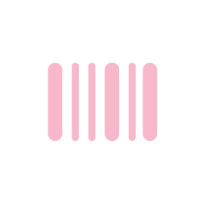
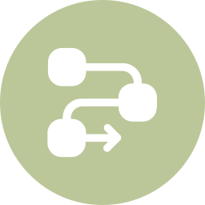

| Object | Type | RGB | RGB Circle | Black | Black Circle | White | White Circle |
|--------|------|-----|-----------|-------|-------------|-------|-------------|
| attack-pattern | sdo |  |  |  |  |  |  |
| campaign | sdo |  |  |  |  |  |  |
| course-of-action | sdo |  |  |  |  |  |  |
| grouping | sdo |  |  |  |  |  |  |
| identity | sdo |  |  |  |  |  |  |
| identity_group | sdo |  |  |  |  |  |  |
| identity_system | sdo |  |  |  |  |  |  |
| identity_organization | sdo |  |  |  |  |  |  |
| identity_individual | sdo |  |  |  |  |  |  |
| identity_class | sdo |  |  |  |  |  |  |
| incident | sdo |  |  |  |  |  |  |
| indicator | sdo |  |  |  |  |  |  |
| infrastructure | sdo |  |  |  |  |  |  |
| intrusion-set | sdo |  |  |  |  |  |  |
| location | sdo |  |  |  |  |  |  |
| malware | sdo |  |  |  |  |  |  |
| malware_family | sdo |  |  |  |  |  |  |
| malware-analysis | sdo |  |  |  |  |  |  |
| note | sdo |  |  |  |  |  |  |
| observed-data | sdo |  |  |  |  |  |  |
| opinion | sdo |  |  |  |  |  |  |
| report | sdo |  |  |  |  |  |  |
| threat-actor | sdo |  |  |  |  |  |  |
| tool | sdo |  |  |  |  |  |  |
| vulnerability | sdo |  |  |  |  |  |  |
| weakness | sdo |  |  |  |  |  |  |
| artifact | sco |  |  |  |  |  |  |
| autonomous-system | sco |  |  |  |  |  |  |
| directory | sco |  |  |  |  |  |  |
| domain-name | sco |  |  |  |  |  |  |
| email-addr | sco |  |  |  |  |  |  |
| email-message | sco |  |  |  |  |  |  |
| file | sco |  |  |  |  |  |  |
| ipv4-addr | sco |  |  |  |  |  |  |
| ipv6-addr | sco |  |  |  |  |  |  |
| mac-addr | sco |  |  |  |  |  |  |
| mutex | sco |  |  |  |  |  |  |
| network-traffic | sco |  |  |  |  |  |  |
| process | sco |  |  |  |  |  |  |
| software | sco |  |  |  |  |  |  |
| url | sco |  |  |  |  |  |  |
| user-account | sco |  |  |  |  |  |  |
| windows-registry-key | sco |  |  |  |  |  |  |
| x509-certificate | sco |  |  |  |  |  |  |
| bank-account | sco |  |  |  |  |  |  |
| bank-card | sco |  |  |  |  |  |  |
| cryptocurrency-transaction | sco |  |  |  |  |  |  |
| cryptocurrency-wallet | sco |  |  |  |  |  |  |
| phone-number | sco |  |  |  |  |  |  |
| user-agent | sco |  |  |  |  |  |  |
| relationship | sro |  |  |  |  |  |  |
| sighting | sro |  |  |  |  |  |  |
